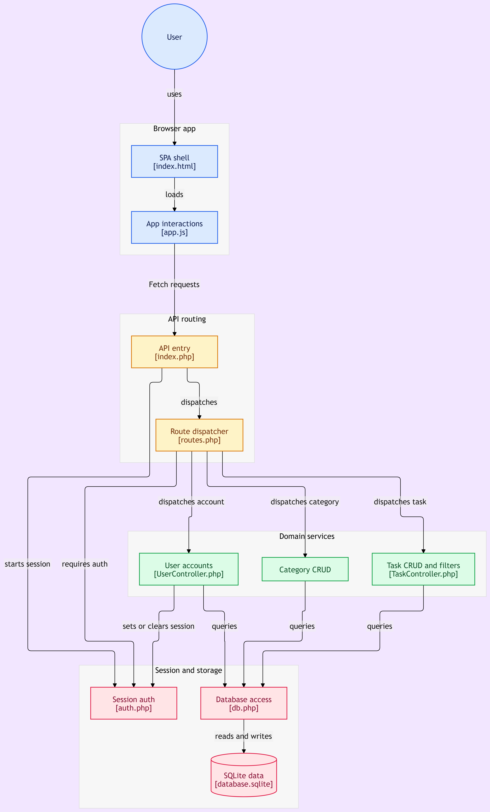

# PIAiWS Task Manager

A single-page application (SPA) for managing tasks and categories, built with pure PHP 8 without any external libraries or frameworks. The application uses an SQLite database and a vanilla JavaScript frontend.

---

## Architecture Diagram



---

## Tech Stack

- **Backend:** PHP 8.2 (Vanilla)
- **Database:** SQLite 3 (PDO driver)
- **Frontend:** HTML5, CSS3, JavaScript (ES6+ Native Fetch API)
- **Authentication:** Native PHP Sessions + `password_hash()` / `password_verify()`

This project requires no Composer, npm, external CDNs, or build steps.

---

## Features

- **Authentication:** User registration, login, logout, and session-protected API routes.
- **Categories:** Full CRUD operations isolated by user account.
- **Tasks:** Full CRUD operations supporting title, description, due date, priority (1–5), and status (`pending`, `in_progress`, `completed`).
- **Filtering & Search:** Combined filters by category, status, and title search (300ms debounce).
- **UI:** Responsive dark-themed interface.

---

## Project Structure

```text
piaiws-task-manager/
├── diagram.png           # System architecture and flow diagram
├── index.html            # SPA shell
├── style.css             # Dark theme stylesheet
├── app.js                # Frontend application logic
├── router.php            # Router for built-in PHP development server
├── database.sqlite       # Database file (automatically generated)
└── api/
    ├── index.php         # API entry point
    ├── db.php            # PDO connection and schema initialization
    ├── auth.php          # Session management and JSON response helpers
    ├── routes.php        # API request router
    ├── .htaccess         # Apache URL rewrite configuration
    └── controllers/
        ├── UserController.php
        ├── CategoryController.php
        └── TaskController.php
```

---

## Setup and Installation

The SQLite database file (`database.sqlite`) is automatically initialized upon the first API request if it does not exist.

### Option 1: Built-in PHP Server (Recommended)

Run the built-in PHP development server from the project root directory:

```bash
php -S localhost:8000 router.php
```

Access the application at [http://localhost:8000](http://localhost:8000).

### Option 2: Apache (XAMPP / LAMP)

1. Clone or copy the project into your web root directory (e.g., `htdocs/piaiws-task-manager`).
2. Ensure `mod_rewrite` is enabled in your Apache configuration.
3. Access the application at [http://localhost/piaiws-task-manager/](http://localhost/piaiws-task-manager/).

---

## API Reference

All responses return JSON format. Protected endpoints require an active PHP session (except `/api/register` and `/api/login`).

### Authentication

| Method | Endpoint | Description |
|---|---|---|
| `POST` | `/api/register` | Register a new user |
| `POST` | `/api/login` | User login |
| `GET` | `/api/logout` | Destroy session and logout |

**Payload (`POST /api/register`):**

```json
{
  "username": "user",
  "password": "secure_password"
}
```

### Categories

| Method | Endpoint | Description |
|---|---|---|
| `GET` | `/api/categories` | Fetch categories for the current user |
| `POST` | `/api/categories` | Create a new category |
| `PUT` | `/api/categories/{id}` | Update an existing category |
| `DELETE` | `/api/categories/{id}` | Delete a category |

### Tasks

| Method | Endpoint | Description |
|---|---|---|
| `GET` | `/api/tasks` | Fetch tasks (supports query filters) |
| `POST` | `/api/tasks` | Create a new task |
| `PUT` | `/api/tasks/{id}` | Update a task |
| `DELETE` | `/api/tasks/{id}` | Delete a task |

**Query Parameters (`GET /api/tasks`):**

- `category` (int) — Category ID
- `status` (string) — Task status (`pending`, `in_progress`, `completed`)
- `search` (string) — Search query for task title

**Example Request:**

```http
GET /api/tasks?category=1&status=pending&search=homework
```

---

## Security Considerations

- **SQL Injection Prevention:** Data queries strictly utilize PDO prepared statements.
- **Password Hashing:** Passwords are hashed using the standard bcrypt algorithm via PHP's `password_hash()`.
- **Data Isolation:** Database queries enforce user ownership using `user_id` retrieved directly from the authenticated session.

---

## License

This project is licensed under the MIT License.
